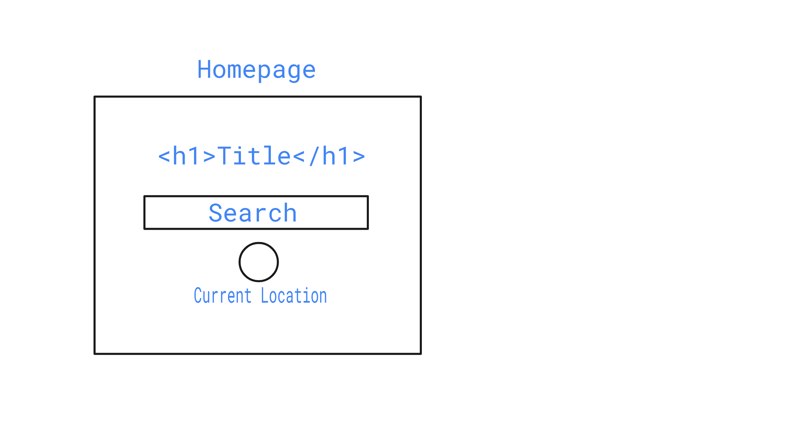
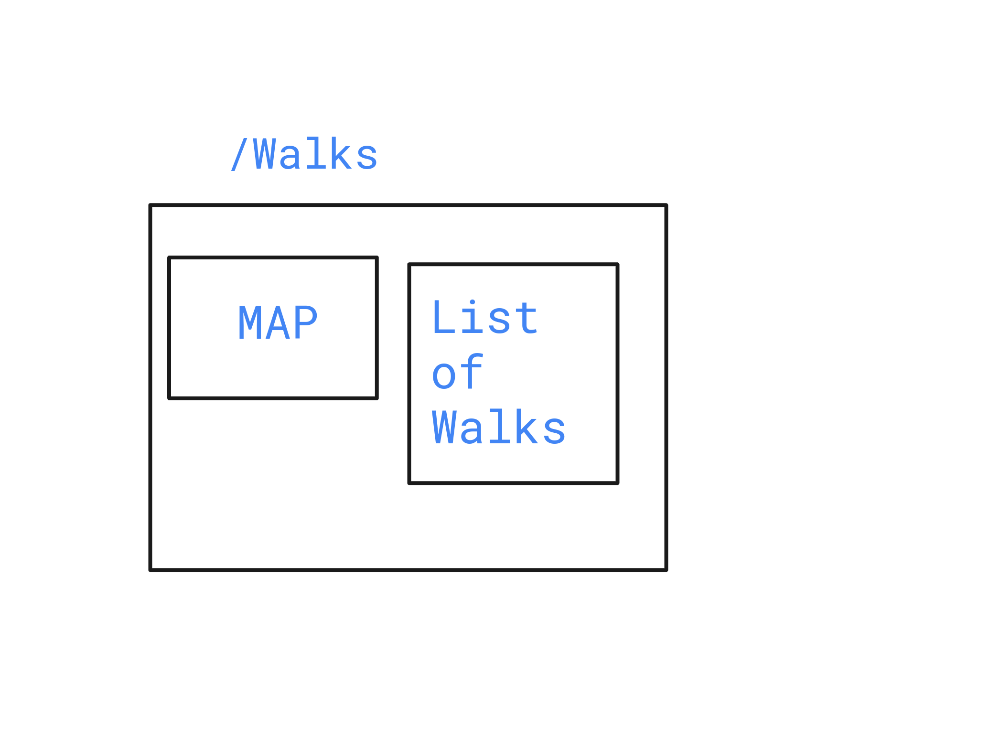
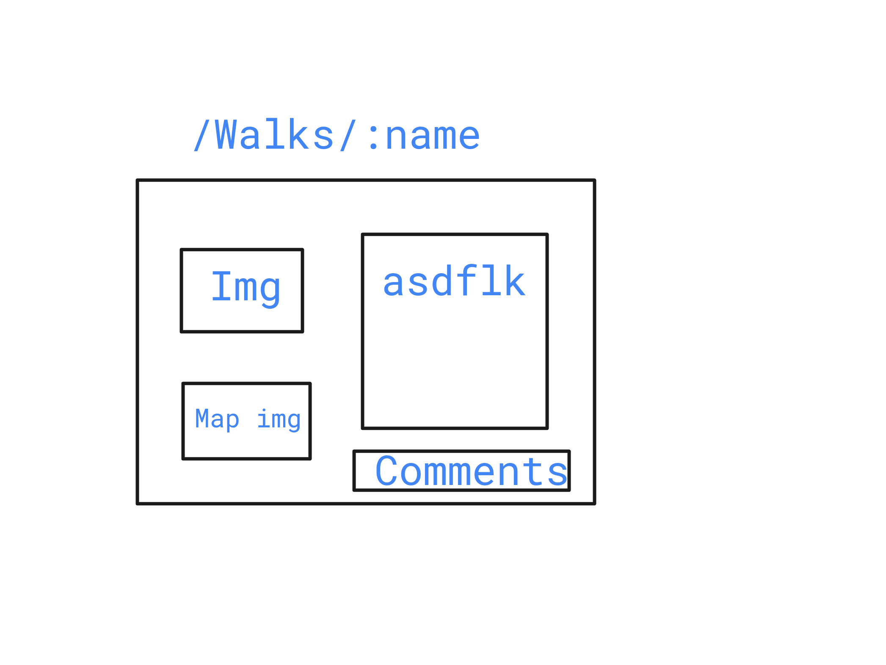
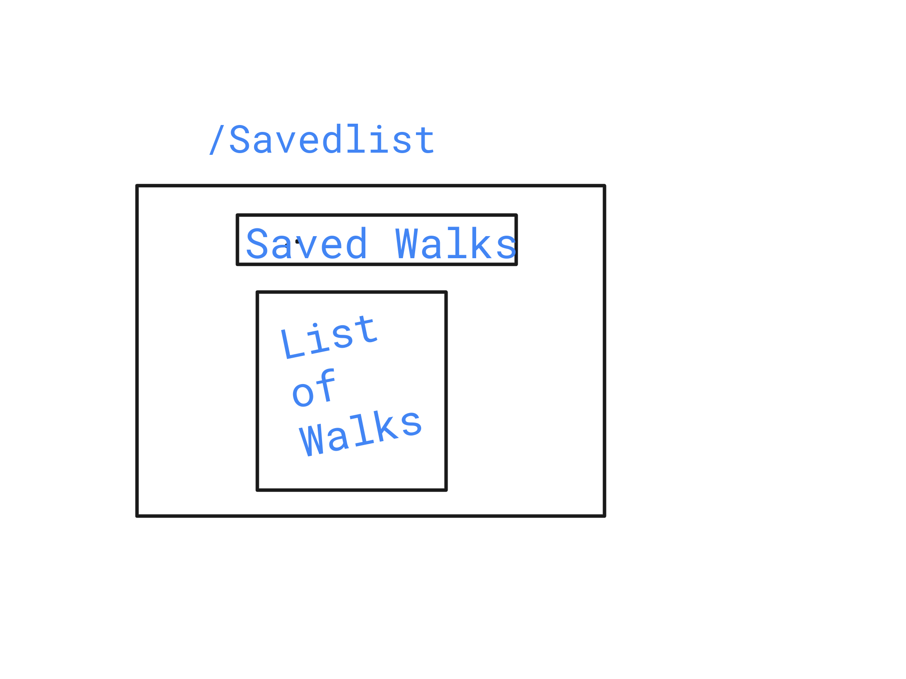
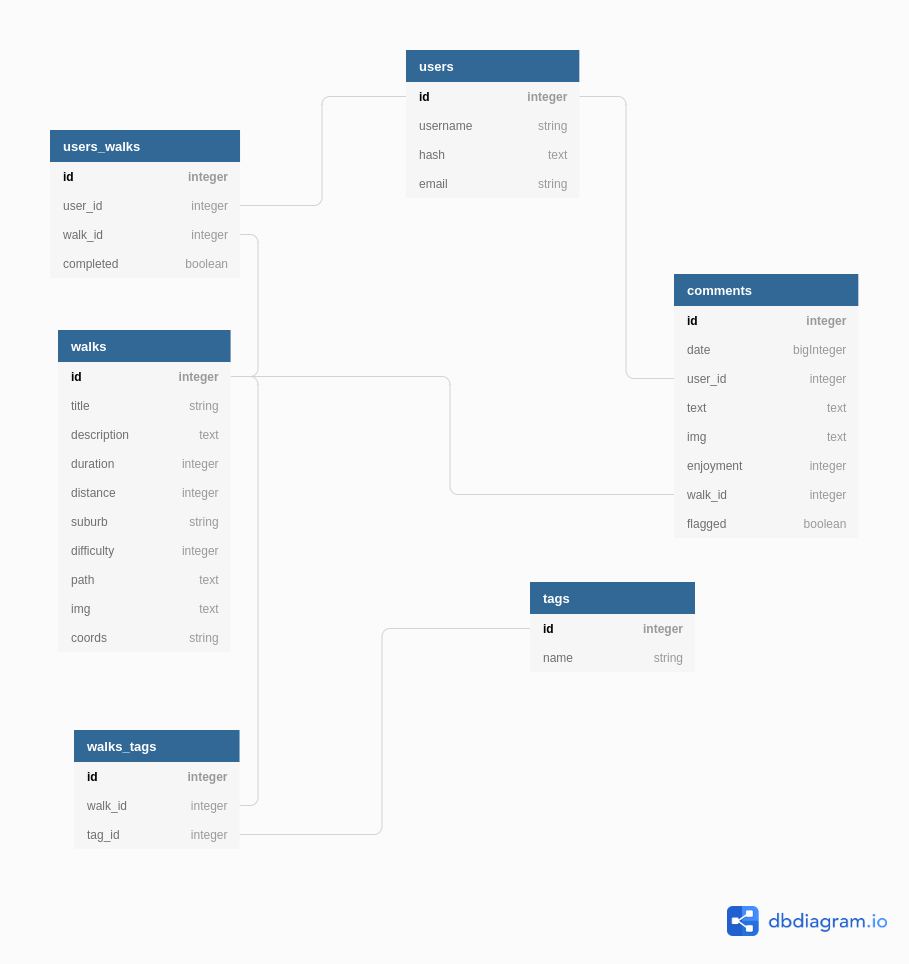

# Walk Me!  (name TBC)

## Getting Started

If you'd like to add to our stunning Welly Walks repo here's how to get started:

```
cd workspace
git clone + https link
cd myRepo
git checkout -b feature/aFeature  
code .  
npm i
npm run knex migrate:latest
npm run knex seed:run
```

You're good to go! Remember to checkout & pull from the development branch regularly to ensure your feature branch is not too behind updates by others. Also check the Git Protocol at the bottom of this ReadMe for further details 

## Update 3.01pm HR
just pulled and app crashing? 
run this in the terminal for auth:

```
 cp .env.example .env
```

once your database has first been populated, you can now use this shortcut
to delete the sql file, run migrations and run seed sequentially
```
npm run db-reset
```

once your database has first been populated, you can now use this shortcut
to delete the sql file, run migrations and run seed sequentially
```
npx eslint --ext .js,.jsx . --fix
```

## Naming Conventions

#### CLIENT SIDE ACTIONS:

- past tense - imagine this is a report being sent, not a request

examples:

export const walkDeleted = id => {
    return {
        type: 'WALK_DELETED',
        id
    }
}

export const userAdded = details => {
    return {
        type: 'USER_ADDED',
        details
    }
}

#### CLIENT SIDE API REQUESTS:

- use 'fetch' if requesting from the DB or an external API

examples:

export const fetchWalks = () => {
    return dispatch => {
        return request  
        .get('......')
        .then(..............)
        .catch(............)
    }
}

export const fetchUser = () => {
    return dispatch => {
        return request  
        .get('......')
        .then(..............)
        .catch(............)
    }
}

#### SERVERSIDE DB FUNCTIONS

Use present tense + 'get'

examples:

function getWalks(db = connection){
    return db('walks').select()
}

function addUser(db = connection){
    return db('users').insert(newUser)
}


## Wireframes

#### Major Components

| Route | Component | Notes |
|---|---|---|
| / | App | Root Component |
| / | Header | Shows on all pages |
| /walks | WalkFinder | 
| /walks/all | AllWalks |
| /walks/saved | SavedWalks | Authenticated |
| /walks/:name | IndividualWalk
| /login | Login | NOT Authenticated |
| /register | Register | NOT Authenticated |
| /user | User
|---|---|---|


#### Components & Children

App\
\
-- Header\
-- -- Nav\
\
-- Login\
-- Register\
-- User\
\
-- Home\
\
-- WalkFinder\
-- -- WalkList\
-- -- BigMap\
\
-- IndividualWalk\
-- -- Comments\
\
-- SavedWalks\
-- -- PolaroidList\
-- -- -- Polaroid\
\
-- AllWalks\
-- -- PolaroidList\
-- -- -- Polaroid


#### Home



#### Walks



#### Walks/:name



#### SavedList




## API

| Method | Path | Description | NOTES |
|---|---|---|---|
| POST | /api/v1/register | adds a user - registering them | Authenticare
| POST | /api/v1/login | logging in a user and getting user info from DB | Authenticare
| GET | /api/v1/walks | let us see all walks on the page
| GET | /api/v1/walk/:name | shows individual walk with all details and comments
| POST | /api/v1/comments | add a comment for a walk
| GET | /api/v1/walks/saved | shows the logged in persons saved walks
| POST | /api/v1/walks/saved/:id | saves a walk to a users saved walks table
| GET | /api/v1/user | Get the user information
|---|---|---|---|


### API Request and response bodies

### /api/v1/walks

##### _Response_

```js 
{
  id
  title
  img
  coords {
    start: {lat, long} 
    end: {lat, long}
  }
}
```

### /api/v1/walk/:name

##### _Response_

```js
{
  id
  title
  description
  duration
  distance
  suburb
  dog-friendly
  difficulty-rating
  img
  coords {
    start: {lat, long} 
    end: {lat, long}
  }
  comment [
    {
      date: 'date string'
      username: 'string'
      text: 'string'
      img: 'string'
      enjoyment-rating: integer
    }
  ]
}
```

### /api/v1/comments

##### _Request_

```js
{
  comment {
      date: 'date string'
      username: 'string'
      text: 'string'
      img: 'string'
      enjoyment-rating: integer
    }  
}
```

##### _Response_
<!-- TODO: What will the response be? -->

### /api/v1/user

##### _Response_

```js
{
  id
  username
}
```

### /api/v1/walks/saved

##### _Response_

```js
{
  user_id
  saved_walks {
    walk_id
  }
   {
  completed_walks {
   walk_id
  }
}
```

## Global State
The global state object looks a bit like this:

```js

const globalState = {
  search: {
    lat: float(7),
    long: float(7),
    text: string,
  },
  walks: [{
    0: {
      id: int,
      title: string,
      description: string,
      duration: int,
      distance: int,
      suburb: string,
      dogFriendly: bool,
      difficultyRating: int,
      path: string,
      img: string,
      coords: {
        start: string({lat, long})
        end: string({lat, long})
      },
      comments: [
        0: {
          date: dateString,
          username: string,
          text: string,
          img: string,
          enjoymentRating: int,
        }
      ]
    }
  }],
  auth: {
    loggedIn: bool,
    user: {
      id: int,
      username: string,
    }
  },
  completedWalks: [integer, integer],
  savedWalks: [integer, integer],
}
```

## Database



# Notes from Hortense - Git Protocol in a Team!
* Clone & Make a branch Steps 1 - 4
* Merge your feature Steps 5 - 11

## 1. Clone
```
cd workspace
git clone + https link
cd myRepo
```
## 2. Make a branch using the name of your feature
```
git checkout -b feature/aFeature  
code .  
```
## 3. Instal modules & reset the database
```
npm i
npm run knex migrate:latest
npm run knex seed:run
```
## 4. Commit & Push your branch
```
git status 
git add .  
git commit -m “commit message”  
git push origin myBranch  
```


# MERGE TIME!! 
* Feature is done, ready to create a pull request to Development?? 

## 5. Commit your branch
```
git add .  
git commit -m “readyToMerge”   
```

## 6. Pull Development into your branch, open VScode & deal with the conflicts there.

```
git pull origin Development
code .
```
## 7. Vscode

* Files marked C = Conflict
* Files marked M = Modified
* <<<<< Head  = This is you! Current changes, you are HEAD
* <<<<<< Incoming change = pulled in from the Development branch

## 8. Any conflicts or changes need to be saved, added, & committed again

```
git add .
git commit -m “mergeTime”
git push origin myBranch
```
## 9. Github - create pull request

* Create pull request from mybranch to Development (on github)
* Tell the git keeper, they will merge the pull request and there should be 0 conflicts as you have already resolved these in your branch.

# Create a new branch with a new name
```
git checkout -b feature/myNextFeature  
code .  
```
## 10. GitKeeper (This is Kelly!) - merge the request

* Merge the pull request on Github only if there are 0 conflicts, then delete the branch.

## 11. Everyone else now needs to pull from Development & update their modules
```
git pull origin Development
npm i
```
* Reset database
```
rm server/db/dev.sqlite3
npm run knex migrate:latest
npm run knex seed:run

```
