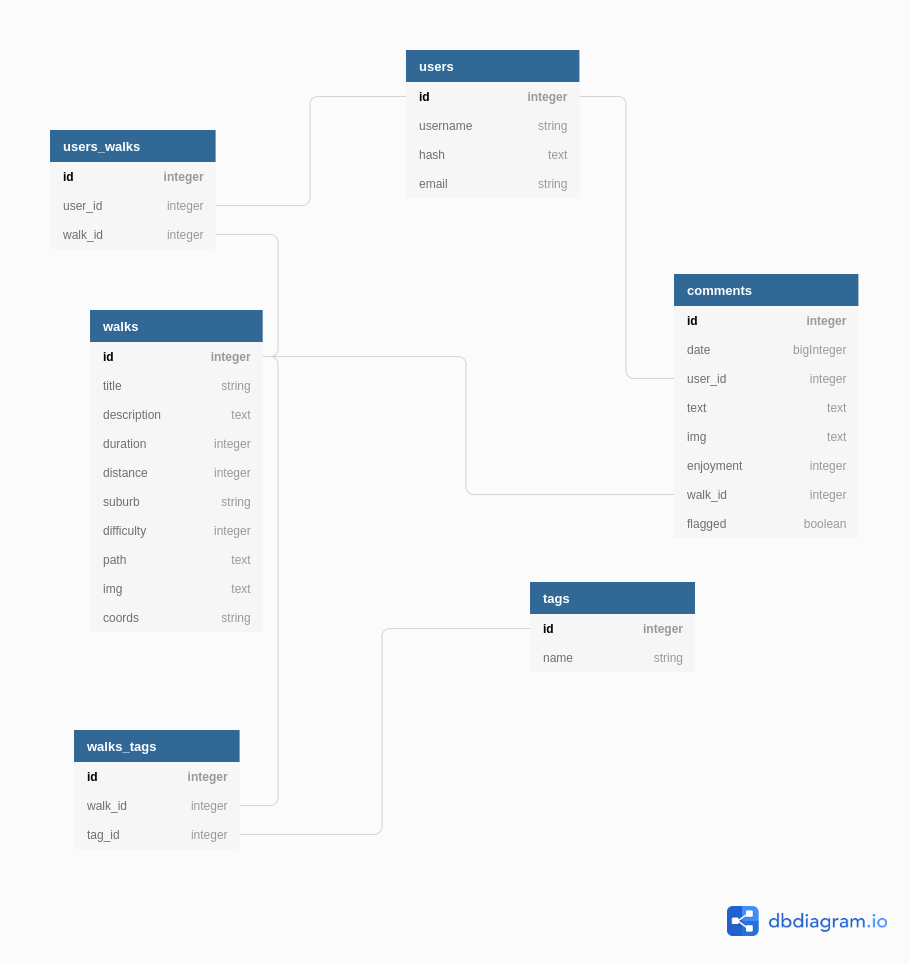

# Walk Me!  (name TBC)

## Getting Started

## Wireframes

## API

| Method | Path | Description | NOTES |
|---|---|---|---|
| POST | /api/v1/register | adds a user - registering them | Authenticare
| POST | /api/v1/login | logging in a user and getting user info from DB | Authenticare
| GET | /api/v1/walks | let us see all walks on the page
| GET | /api/v1/walk/:name | shows individual walk with all details and comments
| POST | /api/v1/comments | add a comment for a walk
| GET | /api/v1/walks/saved | shows the logged in persons saved walks
| GET | /api/v1/user | Get the user information
|---|---|---|---|


### API Request and response bodies

### /api/v1/walks

##### _Response_

```js 
{
  id
  title
  img
  coords {
    start: {lat, long} 
    end: {lat, long}
  }
}
```

### /api/v1/walk/:name

##### _Response_

```js
{
  id
  title
  description
  duration
  distance
  suburb
  dog-friendly
  difficulty-rating
  img
  coords {
    start: {lat, long} 
    end: {lat, long}
  }
  comment [
    {
      date: 'date string'
      username: 'string'
      text: 'string'
      img: 'string'
      enjoyment-rating: integer
    }
  ]
}
```

### /api/v1/comments

##### _Request_

```js
{
  comment {
      date: 'date string'
      username: 'string'
      text: 'string'
      img: 'string'
      enjoyment-rating: integer
    }  
}
```

##### _Response_
<!-- TODO: What will the response be? -->

### /api/v1/user

##### _Response_

```js
{
  id
  username
}
```

### /api/v1/walks/saved

##### _Response_

```js
{
  user_id
  saved_walks {
    walk_id
  }
   {
  completed_walks {
   walk_id
  }
}
```

## Global State
The global state object looks a bit like this:

```js

const globalState = {
  search: {
    lat: float(7),
    long: float(7),
    text: string,
  },
  walks: [{
    0: {
      id: int,
      title: string,
      description: string,
      duration: int,
      distance: int,
      suburb: string,
      dogFriendly: bool,
      difficultyRating: int,
      path: string,
      img: string,
      coords: {
        start: string({lat, long})
        end: string({lat, long})
      },
      comments: [
        0: {
          date: dateString,
          username: string,
          text: string,
          img: string,
          enjoymentRating: int,
        }
      ]
    }
  }],
  auth: {
    loggedIn: bool,
    user: {
      id: int,
      username: string,
    }
  },
  completedWalks: [integer, integer],
  savedWalks: [integer, integer],
}
```

## Database


